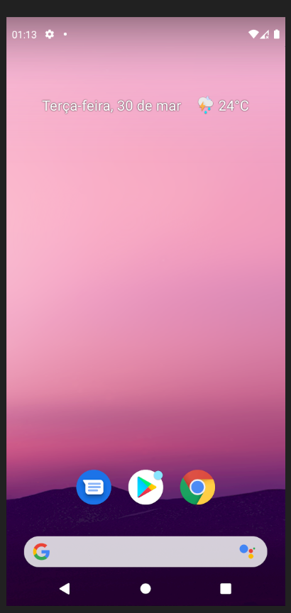

# Skin limpa para emulador do android - Pixel 4
Com o Virtual Device *Pixel 4*, abra o PowerShell e execute:

## Como instalar
```powershell
.\install.ps1
```

<div style="display: flex; align-items: center; justify-content: center;">
    
  </a>
</div>

